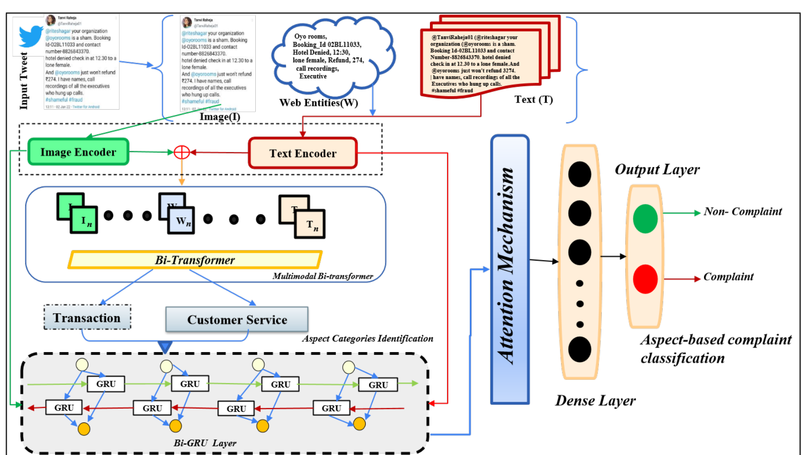

# Multimodal Financial Complaint Identification Framework



A research-oriented multimodal machine learning framework for identifying aspect-level financial complaints from text, images, and image-derived web entities.

The project is based on the **FAB-CI / FinCIMM** framework developed for automated financial complaint identification. It combines financial review text, tweet/review images, and extracted web entities to predict aspect categories and complaint labels.

## Why this project matters

Financial users often report service issues through social media posts, screenshots, and short complaint messages. Text-only models can miss visual evidence such as payment screenshots, refund status pages, transaction errors, or card statements. This project explores how multimodal learning can improve complaint understanding by combining:

- textual complaint content,
- image evidence,
- image-derived web entities,
- aspect-level financial categories,
- complaint / non-complaint labels.

## Key Features

- Multimodal complaint identification using **text + image + web entities**
- Aspect Category Identification (**ACI**) as a multi-label classification task
- Complaint Classification of Aspect Categories (**CAC**)
- RoBERTa-based text representation
- ResNet-152-based image representation
- Attention/fusion-based multimodal representation
- Cleaned experimental notebook included
- Public-safe sample dataset included
- Full/raw dataset intentionally excluded from GitHub

## Financial Domains

The framework covers financial complaint categories such as:

- Transaction
- Retail Banking
- Loan
- Debit Card
- Credit Card
- Investments
- Economy
- Customer Service
- Financial Policies
- Salary

## Repository Structure

```text
.
├── assets/                 # Architecture and result images
├── data/
│   └── sample/             # Public-safe sample dataset only
├── docs/                   # Methodology and upload notes
├── notebooks/              # Cleaned experimental notebook
├── results/                # Metrics and result summary
├── src/fincimm/            # Reusable source code
├── tests/                  # Basic smoke tests
├── config.yaml             # Default training configuration
├── requirements.txt        # Python dependencies
└── README.md
```

## Dataset Notice

The original dataset contains financial posts/reviews, image links, web entities, aspect labels, complaint labels, sentiment, emotion, severity, and complaint causes.

The full dataset is **not included** in this public repository because it may contain user-generated content, image links, and platform-specific data. Only a small synthetic sample is provided to show the expected data format.

Expected public sample format:

```csv
id,domain,text,image_path,web_entities,aspect_labels,complaint_label
sample_001,Transaction,"Money was debited but receiver did not get payment",data/sample/images/sample_001.png,"payment app|upi|bank transfer","net_banking_issue|provider_response",1
```

## Installation

```bash
git clone https://github.com/Mohit-Wankhade/multimodal-financial-complaint-identification.git
cd multimodal-financial-complaint-identification
python -m venv venv
```

For Windows:

```bash
venv\Scripts\activate
```

For Linux/Mac:

```bash
source venv/bin/activate
```

Install dependencies:

```bash
pip install -r requirements.txt
```

## Quick Start

Run preprocessing on the public sample:

```bash
python -m src.fincimm.preprocessing --input data/sample/sample_data.csv
```

Train the multimodal classifier:

```bash
python -m src.fincimm.train --config config.yaml
```

Run inference after training:

```bash
python -m src.fincimm.inference \
  --checkpoint outputs/model.pt \
  --label-map outputs/label_map.json \
  --text "My credit card refund is still pending" \
  --image data/sample/images/sample_002.png \
  --web-entities "credit card|refund|statement"
```

## Model Overview

The framework follows a two-stage multimodal learning setup:

1. **Aspect Category Identification (ACI)**  
   Predicts one or more financial aspect categories from the input review.

2. **Complaint Classification of Aspect Categories (CAC)**  
   Determines whether the predicted aspect represents a complaint or non-complaint case.

The multimodal representation is built from:

- **Text Encoder:** RoBERTa
- **Image Encoder:** ResNet-152
- **Web Entity Features:** extracted from image context
- **Fusion Layer:** combines text, image, and entity signals
- **Classifier:** predicts aspect-level complaint labels

## Reported Results

Summary from the project report:

| Task | Metric | Highlight |
|---|---:|---|
| ACI | Macro-F1 | FAB-CI outperformed text-only, image-only, concatenation, SOTA, and VisualBERT baselines across domains |
| CAC | Macro-F1 | Highest reported CAC Macro-F1 reached 93.27 in the Transaction domain |
| Multimodal comparison | Observation | Text + image + web entities improved performance over unimodal baselines |

More details are available in [`results/metrics_summary.md`](results/metrics_summary.md).

## Limitations

- Original experiments were mainly English-language focused.
- Sarcasm and indirect complaint expressions remain difficult.
- Some social media images are noisy or low-quality.
- The public repository contains sample data only, not the complete training dataset.

## Future Work

- Add FastAPI or Streamlit demo
- Add model checkpoint release separately
- Add Docker support
- Add MLflow or Weights & Biases experiment tracking
- Improve multilingual and Hinglish complaint detection
- Add explainability visualization for modality attention

## Author

**Mohit Kumar Wankhade**  
B.Tech Artificial Intelligence and Robotics  
Madhav Institute of Technology and Science, Gwalior

- GitHub: https://github.com/Mohit-Wankhade
- LinkedIn: https://linkedin.com/in/mohit-wankhade-a9037b205

## Disclaimer

This repository is for academic and portfolio purposes. The original/raw dataset, private image files, and model checkpoints are not included in the repository.
